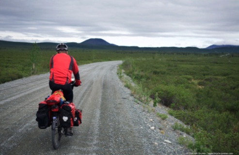

# Cyclik
***
##### For better experience click here:
## Why we made this:
* To create a welcoming community where users can post beautiful photographs
and share amazing bicycle rides in a given city!
* A beautiful way to store photos organized in albums that collect rides in a particular location. A single entry might include specific details about a location, tips on when to visit and directions. Creating an incredible database of travel guides organized by location.
* Go to site on the web for any cyclist planning their next ride! Be it planning the routes for an extended vacation or a pre workday  morning ride.  



*could be you*

***

## Installation and Documentation:
##### `$ pip install -r requirements.txt`
***
##  Available Scripts

In the project directory, you can run:

##### `$ python3 app.py`
***

## Tech Stack:

```
Python 3
Flask/Jinja
Mongo DB database

```
## Live Link:

***

## Project Link:

***

## Contributors:

***

##


